# Projektdokumentation – Kalorientracker

## Inhaltsverzeichnis

1. [Ausgangslage](#1-ausgangslage)
2. [Lösungsidee](#2-lösungsidee)
3. [Vorgehen & Artefakte](#3-vorgehen--artefakte)
    1. [Understand & Define](#31-understand--define)
    2. [Sketch](#32-sketch)
    3. [Decide](#33-decide)
    4. [Prototype](#34-prototype)
    5. [Validate](#35-validate)
4. [Erweiterungen](#4-erweiterungen)
5. [Projektorganisation](#5-projektorganisation)
6. [KI-Deklaration](#6-ki-deklaration)
7. [Anhang](#7-anhang)

> **Hinweis:** Massgeblich sind die im **Unterricht** und auf **Moodle** kommunizierten Anforderungen.

## 1. Ausgangslage

Wer auf seine Ernährung achtet (z. B. zur Gewichtskontrolle oder beim Muskelaufbau), möchte den Tag über grob im Blick haben, wie viele Kalorien und Makros (Protein, Kohlenhydrate, Fett) schon konsumiert wurden. Bestehende Apps wie MyFitnessPal können das natürlich auch, sind in meinen Augen aber überladen und blenden Werbung ein. Dazu kommt: Wer immer wieder dieselben Mahlzeiten isst, gibt die gleichen Werte gefühlt zum hundertsten Mal ein.

- **Problem:** Bestehende Tracking-Apps sind zu komplex und ignorieren, dass viele Mahlzeiten Wiederholungen sind.
- **Ziele:** Schlanker Tagesüberblick mit klarem Fortschritt zum eigenen Ziel; einmal angelegte Mahlzeiten/Lebensmittel mit einem Klick erfassen; persönliches Tagesziel, das sich aus den Körperdaten berechnen lässt; Wochenrückblick und Gewichtsverlauf.
- **Primäre Zielgruppe:** Erwachsene, die ihre Kalorien- und Nährwertaufnahme bewusst verfolgen wollen und dafür eine schnelle, schlanke Lösung suchen.
- **Weitere Stakeholder:** Modulleitung (Bewertung), Mitstudierende als Tester:innen der Usability-Evaluation.

## 2. Lösungsidee

Der Kalorientracker ist ein persönlicher, schlanker Ernährungstracker mit Benutzerkonto. Nach der Anmeldung führt ein kurzes **Onboarding** durch ein paar Fragen (Geschlecht, Alter, Grösse, Gewicht, Aktivität, Ziel) und berechnet daraus automatisch ein **Kalorien- und Makroziel**. Statt jedes Essen neu einzugeben, baue ich mir wiederverwendbare **Lebensmittel** und **Mahlzeiten** auf und protokolliere sie mit wenigen Klicks auf einem Tag.

- **Kernfunktionalität:**
  - **Lebensmittel** mit Nährwerten je 100 g/ml – entweder über eine **öffentliche Lebensmittel-Datenbank** (Open Food Facts) gesucht oder selbst angelegt (inkl. Foto).
  - **Mahlzeiten** als Kombination mehrerer Lebensmittel mit Mengen; Gesamtnährwerte werden automatisch berechnet.
  - **Tageseinträge:** eine ganze Mahlzeit *oder* ein einzelnes Lebensmittel (mit Gramm/Milliliter) zu einem Tag hinzufügen, jeweils mit Mahlzeitentyp (Frühstück, Mittag, Abendessen, Snack).
  - **Dashboard** mit Kalorienring und Makro-Übersicht, **Verlauf** der letzten 7 Tage, **Gewichtstracker** mit Verlaufs-Chart, **Profil** mit anpassbarem Ziel und wählbarem Farbschema (Dark/Light).
- **Annahmen:** Nutzer:innen wollen wenig Aufwand pro Logging-Vorgang und ein nachvollziehbares Tagesziel, das sie nicht selbst ausrechnen müssen.
- **Abgrenzung:** Kein Barcode-Scan; keine sozialen Funktionen (Teilen, Freunde); keine Offline-Nutzung; kein Auswertungszeitraum > 7 Tage im Verlauf; die Datenqualität der externen Lebensmittel-Datenbank wird nicht kuratiert.

> **Hinweis zur Entwicklung:** Das Projekt startete als minimaler Tracker mit „Mahlzeitenvorlagen" (siehe Phasen 3.1–3.3) und wurde anschliessend bewusst zu einem vollwertigen, personalisierten Tracker ausgebaut. Die über den ursprünglichen Umfang hinausgehenden Funktionen sind in **Kapitel 4 (Erweiterungen)** dokumentiert.

## 3. Vorgehen & Artefakte

Das Projekt orientierte sich am Design-Sprint-Vorgehen aus dem Unterricht.

### 3.1 Understand & Define

- **Zielgruppenverständnis:** Im Problemraum habe ich bestehende Tracking-Apps analysiert (MyFitnessPal, Yazio, FatSecret u. a.) und Erfahrungen aus dem eigenen Umfeld einbezogen. Die ausführliche **Markt-, Konkurrenz- und Datenquellen-Analyse** liegt als Artefakt unter [docs/marktanalyse.md](docs/marktanalyse.md) (über den Unterrichtsumfang hinaus, siehe Kap. 4). Daraus entstanden zwei Proto-Personas:

| Persona | Profil | Ziel | Frust heute |
| --- | --- | --- | --- |
| **Marco, 26** | sportlich aktiv, Muskelaufbau, isst oft dasselbe | genug Protein, Tagesüberblick auf einen Blick | tippt dieselben Werte „zum hundertsten Mal" ein |
| **Sandra, 38** | berufstätig, möchte Gewicht halten, Routinegerichte | schneller Überblick mit wenig Aufwand | bestehende Apps zu überladen, Werbung, kennt ihren Bedarf nicht |
- **Wesentliche Erkenntnisse:**
  - Wiederholung ist riesig: Über die Woche kehren oft dieselben 5–10 Mahlzeiten wieder. Genau hier setzt das Prinzip wiederverwendbarer Mahlzeiten an.
  - Ein sichtbares Ziel motiviert mehr als reine Zahlen – ein Fortschrittsring wirkt stärker als eine reine Tabelle.
  - Viele Nutzer:innen kennen ihren genauen Kalorienbedarf nicht – die App sollte ihn aus den Körperdaten herleiten können.
  - Lebensmittelsuchen werden häufig abgebrochen, wenn das gesuchte Produkt nicht sofort gefunden wird.

### 3.2 Sketch

- **Variantenüberblick:** Drei Skizzen entstanden:
  - (a) klassisches Eingabeformular pro Mahlzeit
  - (b) Sammlung wiederverwendbarer Mahlzeiten mit „Tap-to-Log"
  - (c) Tagesplan mit fixen Mahlzeit-Slots
- **Skizzen:** Die drei Varianten als schematische Wireframes (Variante b markiert = gewählt):

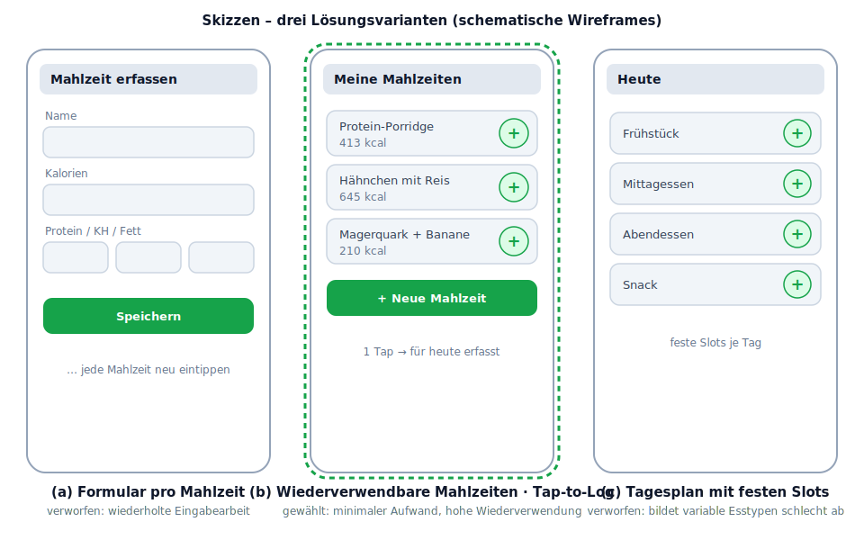

(a) wurde verworfen wegen wiederholter Eingabearbeit, (c) weil sie unterschiedliche Esstypen (z. B. mehrere Snacks) nicht sauber abbildet.

### 3.3 Decide

Gewählt habe ich Variante (b). Entscheidkriterien waren minimaler Aufwand pro Logging-Vorgang, niedrige kognitive Last, hohe Wiederverwendung und einfache technische Umsetzung in SvelteKit.

**End-to-End-Ablauf (Hauptworkflow „Essen erfassen"):**
1. Nutzer:in öffnet das Dashboard und sieht den aktuellen Tagesstand (Kalorienring + Makros).
2. Klick auf „Hinzufügen" → Tab „Mahlzeiten" oder „Lebensmittel" wählen.
3. Eine bestehende Mahlzeit auswählen **oder** ein Lebensmittel suchen/anlegen und die Menge angeben.
4. Mahlzeitentyp wählen → Eintrag erscheint sofort auf dem Dashboard, der Kalorienring aktualisiert sich.
5. Über „Verlauf" / „Gewicht" / „Profil" lassen sich Woche, Gewichtsverlauf und Ziel überblicken bzw. anpassen.

**User-Journey-Map** des Hauptworkflows (Phasen, Screens, Aktionen, Gedanken, Erleben):

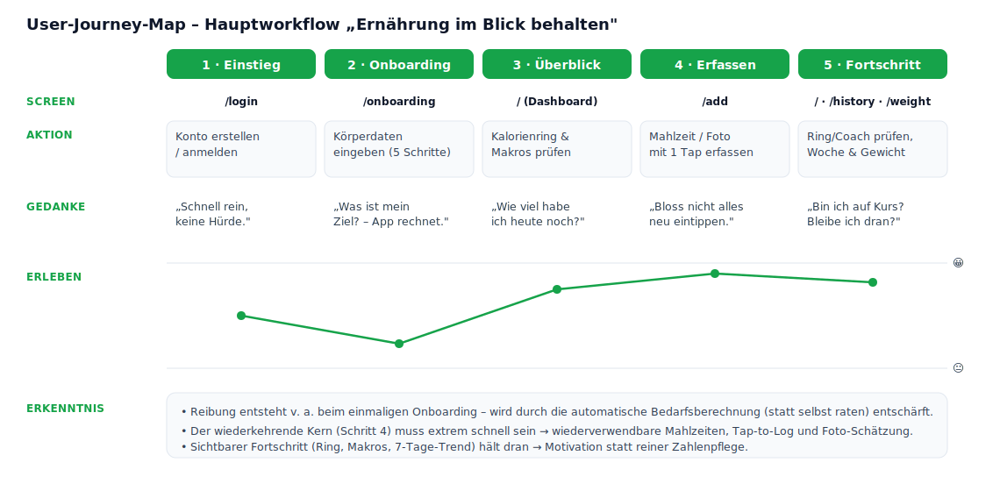

**Mockup:** Als Referenz für die Ausgestaltung diente ein selbst erstellter, klickbarer **Figma-Prototyp**: <https://www.figma.com/proto/WGIBvorlP9wmaHF67J3IIC/Fitness-App>. Er legte den Kern-Workflow und die Screen-Struktur fest (Dashboard mit Fortschritt, Hinzufügen-Flow, Listen-/Detailansichten). Die umgesetzte Oberfläche (Screenshots in Kap. 3.4.2) realisiert dieses Konzept und geht in mehreren Punkten darüber hinaus (siehe Kap. 4).

### 3.4 Prototype

#### 3.4.1 Erster Prototyp (für die Evaluation)

Zunächst entstand ein **bewusst schlanker erster Prototyp**, der in der Usability-Evaluation (Kap. 3.5) mit Nutzer:innen getestet wurde. Er ist als eigener Branch [`prototyp-1`](https://github.com/RoccoBlass/Prototyp/tree/prototyp-1) eingefroren und separat deployt: <https://kalorientracker-prototyp.pages.dev>.

**Umfang des ersten Prototyps:** Dashboard mit Kalorienring & Makros, manuelles Hinzufügen einzelner Lebensmittel (frei eingetippte Nährwerte), Tagesverlauf und Profil – als Einzelnutzer-App **ohne Login**, mit **fest hinterlegtem Tagesziel** und **ohne** Datenbank-Suche, zusammengesetzte Mahlzeiten, Gewichtstracker oder KI. Genau diese Lücken wurden im Test sichtbar und führten zu den Erweiterungen in Kap. 4.

| | |
| --- | --- |
| 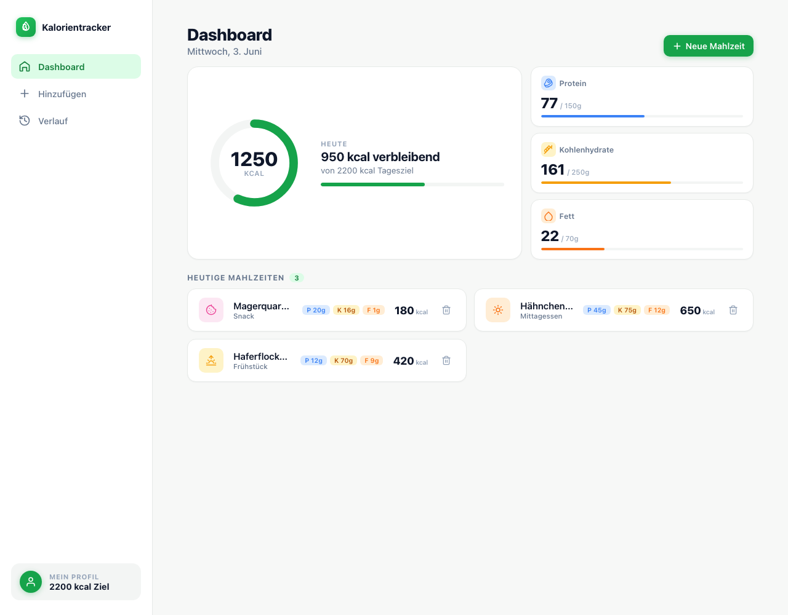 | 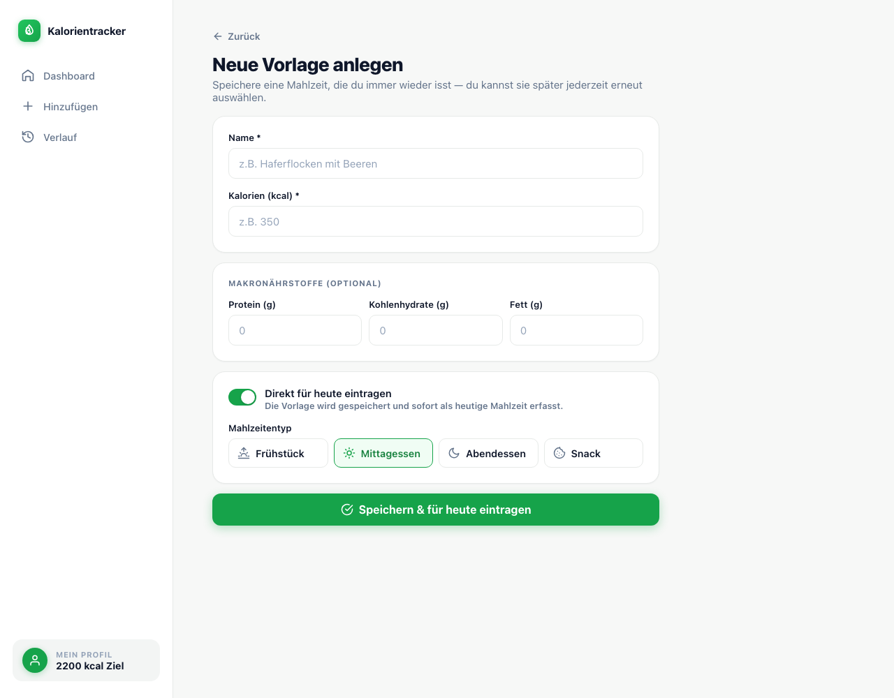 |

*Erster Prototyp (Stand der Evaluation): Dashboard und manuelle Lebensmittel-Erfassung – schlanker und ohne die späteren Erweiterungen.*

#### 3.4.2 Entwurf & Design der umgesetzten App

Aus dem ersten Prototyp wurde – getrieben von der Evaluation (3.5) und den daraus abgeleiteten Erweiterungen (Kap. 4) – die folgende **umgesetzte App**.

**Informationsarchitektur** – nach Login flach und aufgabenorientiert:

| Route | Funktion |
| --- | --- |
| `/login` | Registrierung & Anmeldung |
| `/onboarding` | Ersteinrichtung: Körperdaten → automatisch berechnetes Ziel |
| `/` | Dashboard (Tagesüberblick: Kalorienring, Makros, Einträge) |
| `/add` | Hinzufügen-Hub mit Tabs „Foto", „Text", „Barcode" (KI/Datenbank), „Lebensmittel" (Suche) und „Mahlzeiten" |
| `/add/food/new`, `/add/food/[id]` | Eigenes Lebensmittel anlegen / bearbeiten |
| `/add/meal/new`, `/add/meal/[id]` | Mahlzeit aus Lebensmitteln zusammenstellen / bearbeiten |
| `/weight` | Gewichtstracker mit Verlaufs-Chart |
| `/history` | Verlauf der letzten 7 Tage |
| `/profile` | Profil, Körperdaten, Ziel, Farbschema (Dark/Light), Abmelden |
| `/api/food-search` | Server-Endpunkt für die Open-Food-Facts-Suche |
| `/api/coach` | Server-Endpunkt für das KI-Coach-Feedback (OpenRouter) |
| `/api/estimate-nutrition` | Server-Endpunkt für die KI-Nährwertschätzung aus einem Foto (OpenRouter, Vision) |
| `/api/estimate-food-text` | Server-Endpunkt für die KI-Nährwertschätzung aus Freitext (OpenRouter) |
| `/api/product-by-barcode`, `/api/read-barcode` | Barcode-Lookup (Open Food Facts) bzw. KI-Barcode-Erkennung aus dem Foto |
| `/logout` | Abmelden (POST-Endpunkt) |

Auf dem Desktop wird die Navigation als Sidebar dargestellt, mobil als Bottom-Nav mit hervorgehobenem „+"-Button. Nicht angemeldete Nutzer:innen werden auf `/login` geleitet, angemeldete ohne abgeschlossenes Onboarding auf `/onboarding` (Zugriffsschutz in `src/hooks.server.js`).

**User Interface Design:** Die folgenden Screenshots zeigen die wichtigsten Screens der umgesetzten App (Dark Mode als Standard, mit Demo-Account und Beispieldaten erstellt).

**Anmeldung & Registrierung**

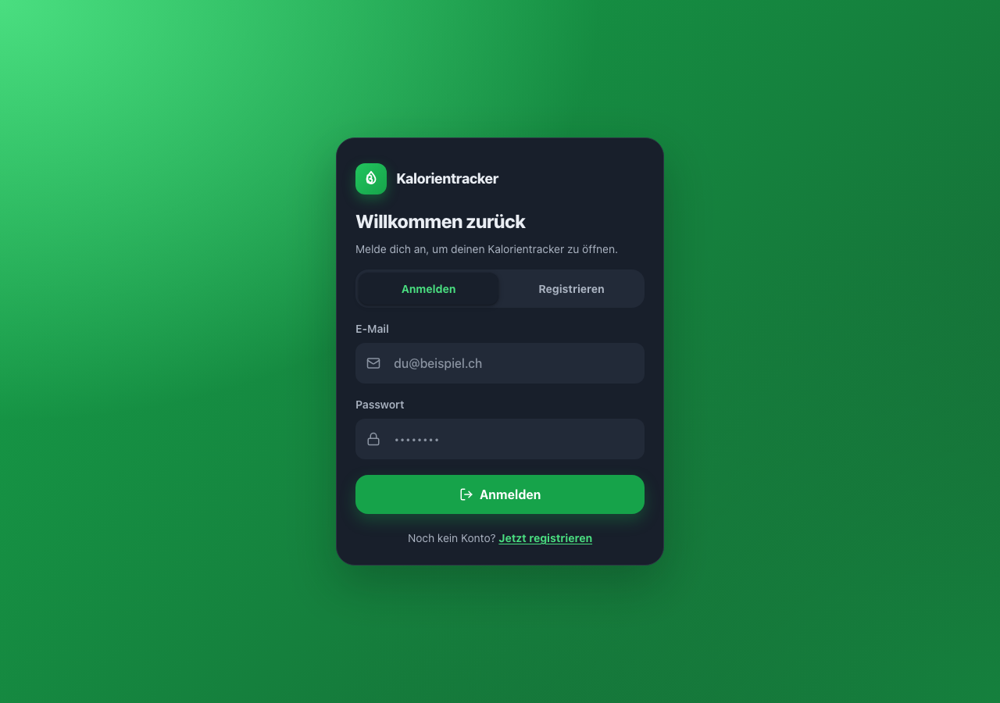

Schlanker Einstieg mit Umschalter zwischen Anmelden und Registrieren.

**Onboarding (Schritt 1 von 5)**

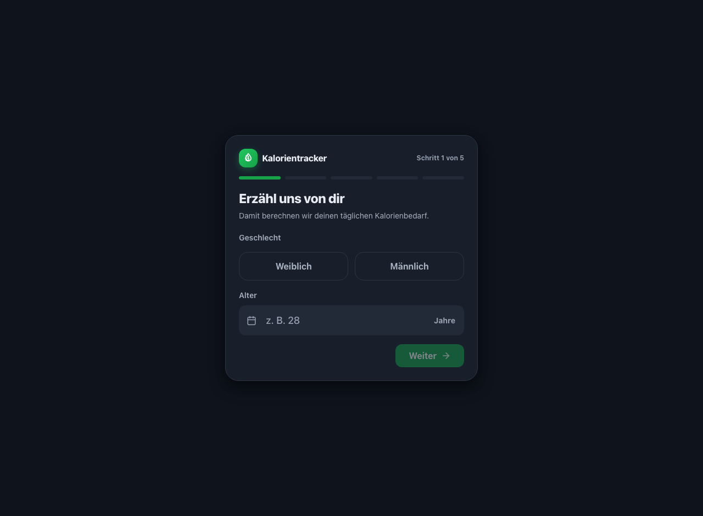

Geführter Wizard, der aus den Körperdaten automatisch das Tagesziel berechnet (siehe Kap. 4.2).

**Dashboard**

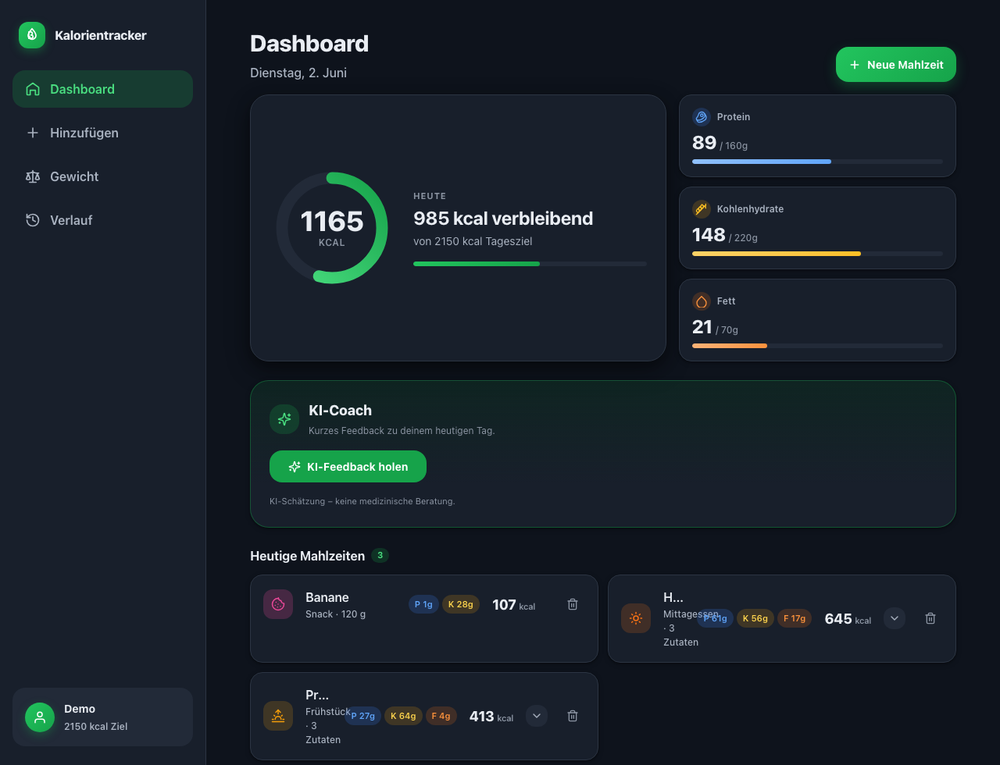

Tagesüberblick mit Kalorienring, Makro-Fortschritt, KI-Coach-Karte (Kap. 4.7) und den heutigen Einträgen.

**Hinzufügen**

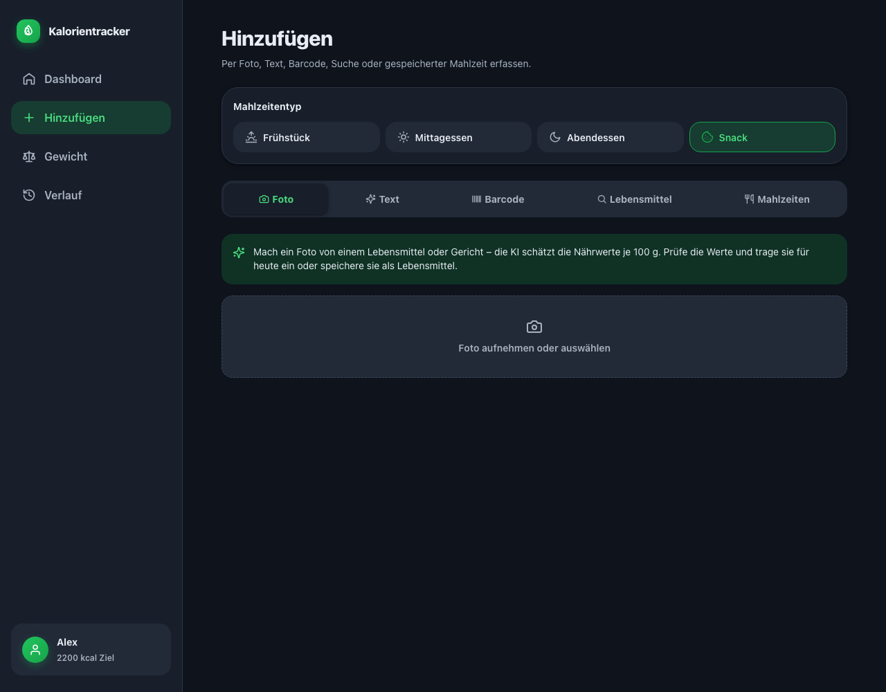

Mahlzeitentyp wählen, danach über fünf Tabs erfassen: **Foto** (KI-Schätzung, Kap. 4.8), **Text** (KI aus Freitext, Kap. 4.9), **Barcode** (Open-Food-Facts-Abgleich, Kap. 4.10), **Lebensmittel** (Suche & eigene) und **Mahlzeiten**.

| | |
| --- | --- |
| 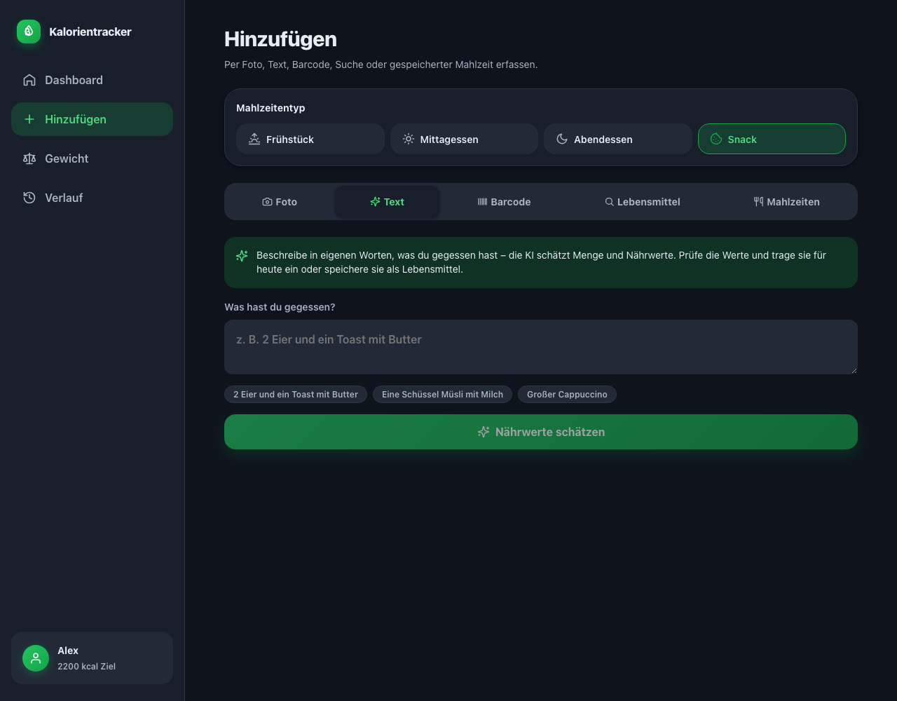 | 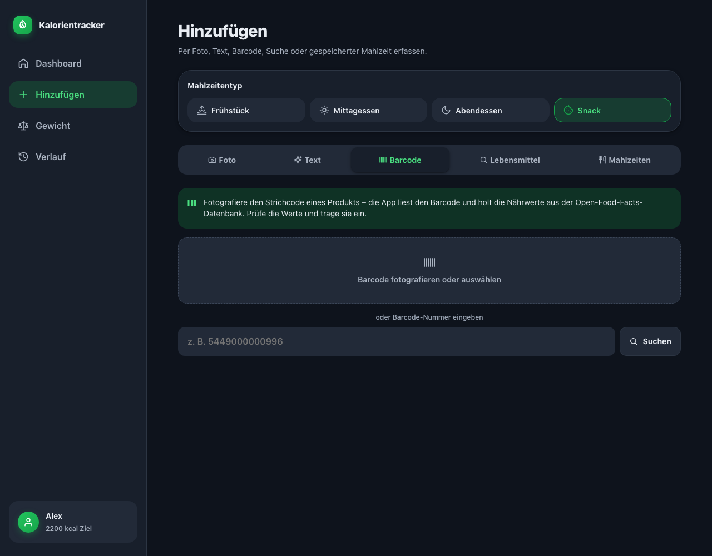 |

**Lebensmittel anlegen**

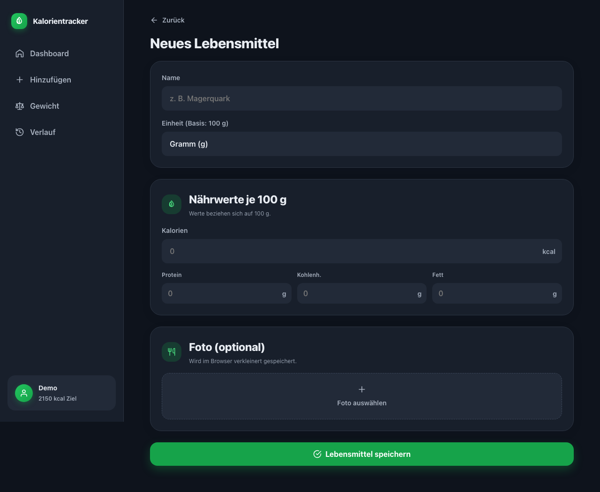

Eigenes Lebensmittel mit Nährwerten je 100 g/ml und optionalem Foto (wird im Browser verkleinert).

**Mahlzeit zusammenstellen**

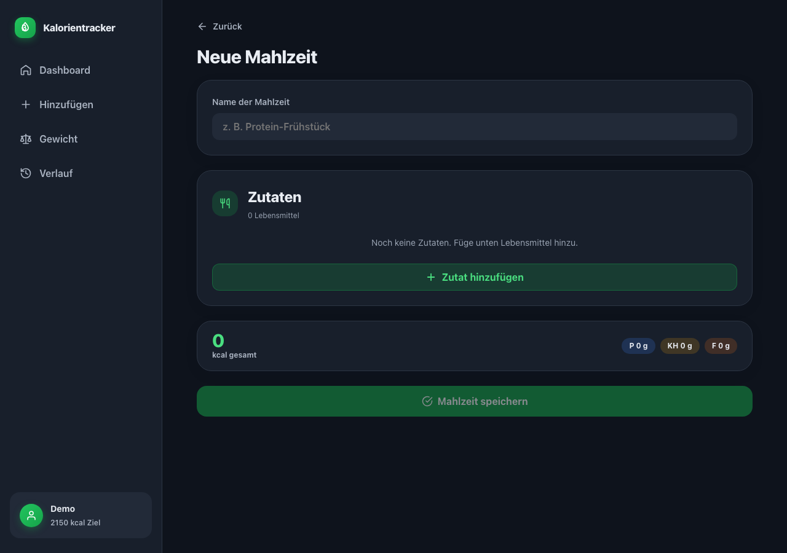

Mehrere Zutaten zu einer Mahlzeit kombinieren – die Gesamtnährwerte werden live berechnet (Kap. 4.4).

**Gewicht**

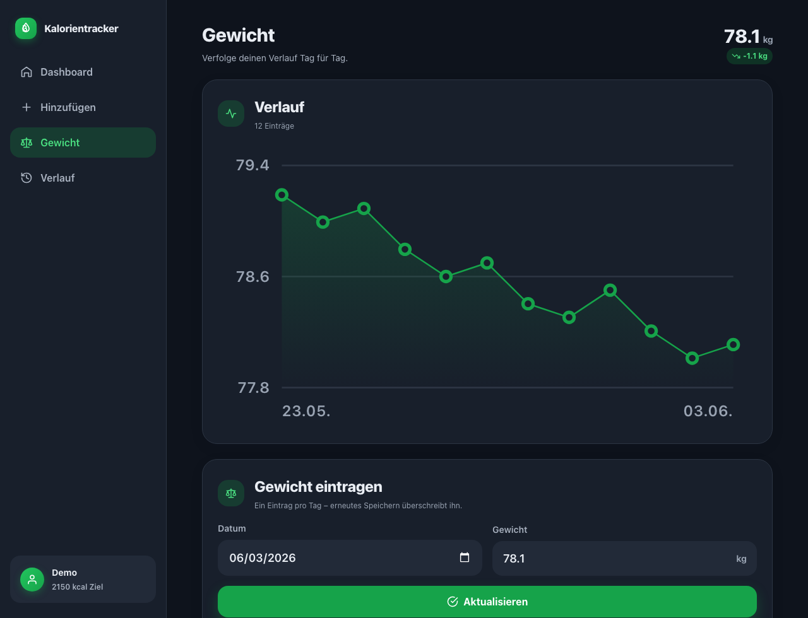

Tägliche Gewichtserfassung mit SVG-Verlaufsdiagramm ohne externe Chart-Bibliothek (Kap. 4.5).

**Verlauf**

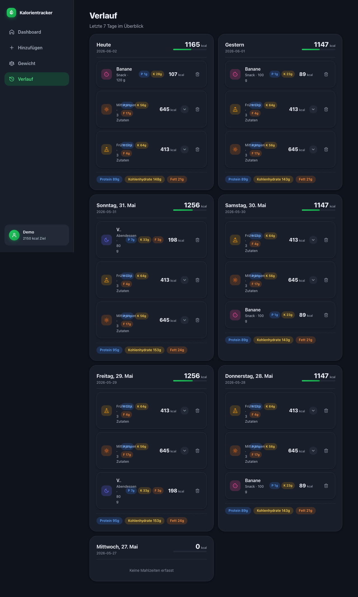

Rückblick auf die letzten 7 Tage mit Tagessummen je Tag.

**Profil**

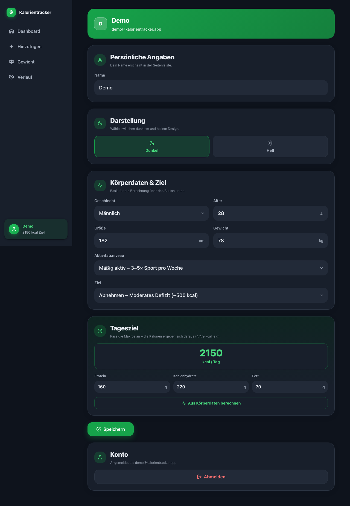

Persönliche Angaben, Körperdaten & Ziel, Farbschema (Dark/Light, Kap. 4.6) sowie Abmelden.

**Designentscheidungen:**
- **Mobile-first** mit responsivem Desktop-Layout (ab 900 px Sidebar). Das Tracken passiert typischerweise am Handy.
- **Grünes Theming** als positives Signal („Gesundheit"); Rot ausschliesslich, wenn das Tagesziel überschritten wird.
- **Kalorienring statt Balken** auf dem Dashboard, weil ein Ring den Fortschritt schneller erfassbar macht. Die Ringmitte ist mit „kcal gegessen" beschriftet, damit die Zahl eindeutig vom „verbleibend"-Wert daneben unterscheidbar ist.
- **Überschreitung sichtbar machen:** Makro-Balken zeigen ein Überschreiten des Ziels explizit – Chip „+Xg" und schraffierter Balken statt nur „voll". Unter dem Ring ordnet ein **7-Tage-Mini-Trend** den heutigen Wert ein.
- **Mahlzeitentyp wird automatisch nach Tageszeit vorgeschlagen** (Frühstück bis 10, Mittag bis 14, Snack bis 17, sonst Abendessen) – spart einen Klick.
- **Onboarding als geführter Wizard:** Statt die Nutzer:innen ein Kalorienziel raten zu lassen, wird es aus den Körperdaten berechnet (siehe Kap. 4.2).
- **Mahlzeit als ein aufklappbarer Block** im Tagesprotokoll: übersichtlich, Zutaten bei Bedarf einsehbar.

#### 3.4.3 Umsetzung (Technik)

**Technologie-Stack:** SvelteKit (Svelte 5 mit Runes-Syntax, JavaScript ohne TypeScript), MongoDB Atlas über den offiziellen `mongodb`-Treiber, Plain CSS mit Custom Properties (kein UI-Framework). Vite als Build-Tool, Cloudflare-Adapter (`adapter-cloudflare`) für das Deployment auf Cloudflare Pages. Passwort-Hashing mit dem Node-Kern (`node:crypto`, scrypt) ohne externe Auth-Bibliothek. Anbindung an die öffentliche **Open-Food-Facts**-Datenbank (ohne API-Key).

**Tooling:** VS Code mit Svelte-Erweiterung, Node.js + npm lokal, MongoDB Atlas in der Cloud, Cloudflare Pages als Hosting (siehe [wrangler.toml](kalorientracker/wrangler.toml)). Der Einsatz von KI ist in **Kapitel 6 (KI-Deklaration)** beschrieben.

**Struktur & Komponenten:**
- Routen unter [src/routes/](kalorientracker/src/routes/): `+layout.svelte` (Navigation, nur für angemeldete & eingerichtete Nutzer:innen), je Bereich `+page.svelte` (UI) und `+page.server.js` (Loader / Form-Actions). `src/hooks.server.js` löst die Session auf und schützt die Routen.
- Wiederverwendbare Komponenten unter [src/lib/components/](kalorientracker/src/lib/components/): `CalorieBar` (Kalorienring), `NutrientSummary` (Makros), `MealCard` (Tageseintrag, bei Mahlzeiten aufklappbar), `FoodForm` (Lebensmittel-Formular inkl. Foto-Upload), `MealBuilder` (Zutaten-Komposition mit Live-Summe), `WeightChart` (SVG-Verlaufsdiagramm), `Icon` (Inline-SVG-Set, an Lucide angelehnt).
- Reine Hilfslogik unter [src/lib/](kalorientracker/src/lib/): `nutrition.js` (Bedarfsberechnung nach Mifflin-St Jeor), `food.js` (Nährwert-Skalierung, Mahlzeiten-Summen, Mahlzeitentypen) – sowohl client- als auch serverseitig nutzbar.
- Server-only unter [src/lib/server/](kalorientracker/src/lib/server/): `db.js` (alle MongoDB-Zugriffe gekapselt), `auth.js` (scrypt-Hashing, Sessions), `foodInput.js` / `mealInput.js` (Eingabe-Validierung).
- Kein globaler Store: Daten kommen pro Route vom Server-Loader; der angemeldete Benutzer kommt aus `event.locals.user` (im Hook gesetzt) und über den Layout-Loader in alle Seiten.

**Daten & Schnittstellen:**
- Datenbank `KalorienTrackerDB` mit sechs Collections, alle Nutzdaten pro Benutzer (`userId`):
  - `users` – Konto: E-Mail (eindeutig), Passwort-Hash (scrypt), Name, Körperdaten (Geschlecht/Alter/Grösse/Gewicht/Aktivität/Ziel), berechnetes Kalorien-/Makroziel, Farbschema (`theme`, Default `dark`), `onboardedAt`.
  - `sessions` – Anmelde-Sessions mit Token und Ablaufdatum (TTL-Index → automatische Bereinigung).
  - `foods` – eigene Lebensmittel (Nährwerte je 100 g/ml, Einheit, optionales Foto als Base64).
  - `meals` – Mahlzeiten mit Zutaten-Liste (Snapshot je Zutat) und berechneten Gesamtnährwerten.
  - `entries` – Tageseinträge (`kind`: `food`/`meal`, Menge/Einheit, Nährwerte, Mahlzeitentyp, Datum; bei Mahlzeiten zusätzlich der Zutaten-Snapshot).
  - `weightEntries` – Gewicht pro Tag (ein Eintrag je Benutzer und Tag, eindeutiger Index).
- Indizes u. a.: `users.email` (unique), `sessions.expiresAt` (TTL), `foods/meals/entries` je `userId`, `weightEntries` je `userId+date` (unique).
- **Externe Schnittstelle:** Der Server-Endpunkt [`/api/food-search`](kalorientracker/src/routes/api/food-search/+server.js) fragt Open Food Facts ab (primär die neue Such-Engine „search-a-licious", Fallback auf die ältere API), bevorzugt deutsche Produktnamen und sortiert Produkte aus DE/CH/AT nach vorne. Die Abfrage läuft serverseitig (kein CORS, kein API-Key).
- **Externe KI-Schnittstelle:** Der Endpunkt [`/api/coach`](kalorientracker/src/routes/api/coach/+server.js) sendet die Tageswerte (Ziel + Tagessummen) an **OpenRouter** (OpenAI-kompatible API) und zeigt das zurückgegebene Coach-Feedback an. Schlüssel und Modell liegen in der `.env` (`OPENROUTER_API_KEY`, `OPENROUTER_MODEL`); der Aufruf erfolgt serverseitig und nur auf Nutzer-Klick (siehe Kap. 4.7).
- Schreiboperationen laufen über SvelteKit-Form-Actions (progressively enhanced).
- Der DB-Verbindungsstring liegt in `.env` (`DB_URI`) und wird über `$env/dynamic/private` eingebunden – bewusst die **dynamische** Variante statt des in der Vorlesung gezeigten `$env/static/private`, weil die Variablen auf der Cloudflare-Workers-Runtime erst zur Laufzeit (nicht zur Build-Zeit) verfügbar sind.

**Deployment:** Cloudflare Pages (zwei Projekte, je ein Branch; Adapter `adapter-cloudflare`, `wrangler.toml` mit `nodejs_compat` für den MongoDB-Treiber auf der Workers-Runtime). Der Produktions-Build wird lokal erzeugt und per `wrangler pages deploy` hochgeladen (Hilfsskript [`deploy.sh`](deploy.sh) im Repo-Root); die Projekte bleiben mit dem GitHub-Repository verknüpft. Beide Seiten sind live:
- **Hauptseite (Branch `main`):** https://kalorientracker-main.pages.dev
- **Erster Prototyp (Branch `prototyp-1`):** https://kalorientracker-prototyp.pages.dev

**Besondere Entscheidungen:**
- **Snapshot-Prinzip:** Beim Protokollieren werden die Nährwerte in den Tageseintrag *kopiert* (statt nur referenziert). So verfälscht eine spätere Änderung an einem Lebensmittel/einer Mahlzeit keine bereits erfassten Tage. Dasselbe gilt für die Zutaten einer Mahlzeit.
- **Kalorienziel = Summe der Makros:** Das angezeigte Kalorienziel entspricht immer `4·Protein + 4·KH + 9·Fett`, damit Ring und Makro-Anzeige konsistent zusammenpassen.
- **Passwort-Hashing mit `node:crypto` (scrypt):** keine zusätzliche Abhängigkeit, läuft auch in serverless-Umgebungen (Cloudflare Workers, Netlify); Vergleich timing-safe, generische Fehlermeldung beim Login.
- **Fotos als verkleinertes Base64 in MongoDB:** Das Bild wird im Browser per Canvas verkleinert und direkt in der DB gespeichert – kein externer Blob-Speicher/Key nötig (passend zum schlanken Prototyp-Charakter).
- **Open Food Facts ohne Key:** bewusst gewählt, weil sofort einsatzbereit, kostenlos und mit guter DE/CH-Abdeckung (nach Lokalisierung der Abfrage). Alternativen mit Key/OAuth (FatSecret u. a.) wurden geprüft, aber als unnötig aufwändig verworfen.
- **Deployment über lokalen Build:** Der Produktions-Build wird lokal erzeugt und per `wrangler pages deploy` (`deploy.sh`) hochgeladen, statt ihn in der Cloud-Build-Pipeline auszuführen – so wird der native MongoDB-Treiber zuverlässig gebündelt. Die automatischen Cloud-Builds sind deaktiviert, die git-Verknüpfung bleibt bestehen.

### 3.5 Validate

Mit dem **ersten Prototyp** (minimaler Tracker mit wiederverwendbaren Mahlzeiten, Branch `prototyp-1`) wurde eine **formative Usability-Evaluation** durchgeführt. Vorbereitung, Aufgabenblatt und Feedback-Grid liegen unter `Usability-Evaluation/`.

- **URL der getesteten Version:** https://kalorientracker-prototyp.pages.dev (erster Prototyp, Branch `prototyp-1`)
- **Ziele der Prüfung:**
  - Wird die **Startübersicht** verstanden – erkennen Nutzer:innen auf einen Blick die heute gegessenen Kalorien und den Rest bis zum Tagesziel?
  - Ist das zentrale Konzept klar – der Unterschied zwischen einer einmal gespeicherten, **wiederverwendbaren Mahlzeit** und einem **Eintrag für einen Tag**?
  - **Effektivität & Effizienz:** Können Nutzer:innen eine Mahlzeit ohne Hilfe erfassen und einem Tag zuordnen – und wie schnell gelingt das bei einer bereits gespeicherten Mahlzeit?
  - Finden und ändern sie ihr **persönliches Kalorienziel**?
  - Sind Navigation und (deutschsprachige) Begriffe erwartungskonform, und wird das eigentliche Problem gelöst (Ernährung einfach im Blick behalten)?
- **Vorgehen:** Moderierter, szenario-basierter Usability-Test mit **lautem Denken (Think-Aloud)**, on-site am Arbeitsplatz (Testperson und Testleiter:in nebeneinander), primär am Smartphone. Ca. 10 Minuten pro Test: kurze Vorabfragen, sieben einzeln und neutral vorgelegte Aufgaben (Kontext + Ziel, keine Lösungsbegriffe), Kurzfragen nach jeder Aufgabe, Abschlussinterview. Auswertung qualitativ (Beobachtungen, Aussagen) ergänzt um einfache Kennzahlen (Aufgabe gelöst ja/nein, grobe Zeit).
- **Stichprobe:** Gegenseitiges Testen mit **drei Mitstudierenden** (TP1–TP3), die den Prototyp vorher nicht kannten – Profil entspricht der primären Zielgruppe (erwachsene, technikaffine Personen mit Interesse an Ernährungs-Tracking).
- **Aufgaben/Szenarien** (Ausgangslage: „Du beginnst, bewusster auf deine Ernährung zu achten, und nutzt die App zum ersten Mal auf dem Smartphone."):
  1. **Überblick verschaffen:** Wie viel hast du heute bisher gegessen, wie viel ist bis zum Tagesziel noch offen?
  2. **Etwas Wiederkehrendes festhalten:** Ein fast tägliches Frühstück (~350 kcal) so speichern, dass es nicht jedes Mal neu eingegeben werden muss.
  3. **Eine Mahlzeit für heute erfassen:** Genau dieses gespeicherte Frühstück für den heutigen Tag eintragen.
  4. **Einen Fehler korrigieren:** Einen Eintrag, der gar nicht gegessen wurde, wieder entfernen.
  5. **Persönliches Ziel anpassen:** Die App auf höchstens 1'800 kcal/Tag einstellen.
  6. **Rückblick:** Prüfen, ob man in den letzten Tagen in der Nähe des Ziels geblieben ist.
  7. *(optional)* **Eine Angabe richtigstellen:** Die Kalorien des gespeicherten Frühstücks auf den korrekten Wert (~300 kcal) ändern.
- **Kennzahlen & Beobachtungen:**
  - **Messbares Usability-Ziel** (»mind. 4 von 5 Testpersonen erfassen eine gespeicherte Mahlzeit ohne Hilfe in unter 30 s«) **erreicht:** Alle drei Testpersonen erfassten die gespeicherte Mahlzeit (Aufgabe 3) ohne Eingreifen deutlich unter 30 Sekunden. Die Aufgaben 1, 3, 4 und 6 wurden durchgängig selbstständig gelöst.
  - **Positiv:** Die Startübersicht mit Kalorienring wurde sofort verstanden („auf einen Blick klar, wie viel noch geht"). Das Prinzip *einmal speichern → für einen Tag eintragen* war spätestens nach dem ersten Durchlauf klar. Löschen (Aufgabe 4) und Zielanpassung (Aufgabe 5) waren gut auffindbar.
  - **Problem 1 – Konto/Login vermisst (hoch):** Mehrere Testpersonen suchten zu Beginn nach einer Anmeldung bzw. einem persönlichen Profil. Ohne Konto wirkten die Daten „nicht wirklich meine", und es war unklar, ob die Einträge privat und dauerhaft gespeichert sind.
  - **Problem 2 – nur selbst angelegte Mahlzeiten (hoch):** Jedes Lebensmittel/jede Mahlzeit musste mit Nährwerten von Hand eingegeben werden. Die Testpersonen erwarteten, gängige Lebensmittel **suchen** zu können (bereits in Aufgabe 2), und empfanden die manuelle Eingabe als mühsam und als Einstiegshürde. Mehrfach kam der Wunsch, auch ein **einzelnes Lebensmittel** statt immer einer ganzen Mahlzeit zu erfassen.
  - **Problem 3 – Zielwert wirkte willkürlich (mittel):** Das Anpassen des Kalorienziels (Aufgabe 5) gelang, aber die Testpersonen wussten nicht, welcher Wert für sie sinnvoll ist, und wünschten sich einen **Vorschlag auf Basis ihrer Körperdaten**.
- **Zusammenfassung der Resultate:** Das Kernkonzept trägt: Übersicht und wiederverwendbare Mahlzeiten wurden verstanden und schnell bedient, das messbare Usability-Ziel wurde erreicht. Die grössten Schwächen lagen nicht im Ablauf, sondern im **fehlenden Benutzerkonto**, in der **mühsamen manuellen Lebensmitteleingabe** (keine Datenbank/Suche, nur eigene Mahlzeiten) und im **willkürlichen Zielwert**.
- **Abgeleitete Verbesserungen** (priorisiert; alle inzwischen umgesetzt, siehe Kap. 4):
  1. **Benutzerkonten mit Login/Registrierung** und persönlichen, dauerhaft gespeicherten Daten → Kap. 4.1.
  2. **Lebensmittel-Datenbank mit Suche** (Open Food Facts) statt reiner Handeingabe sowie das Erfassen **einzelner Lebensmittel** zusätzlich zu Mahlzeiten → Kap. 4.3 und 4.4.
  3. **Automatische Bedarfsberechnung** über ein kurzes Onboarding (Körperdaten → Kalorien-/Makroziel) statt eines frei geratenen Zielwerts → Kap. 4.2.

## 4. Erweiterungen

Die folgenden Funktionen gehen über den ursprünglichen Mindestumfang (schlanker Tracker mit wiederverwendbaren Mahlzeiten) hinaus.

### 4.1 Benutzerkonten mit Login & Registrierung
- **Beschreibung & Nutzen:** Registrierung und Anmeldung mit E-Mail und Passwort. Erst dadurch sind die Daten pro Person getrennt und über Geräte hinweg nutzbar. Passwörter werden mit scrypt gehasht (kein Klartext), Sessions laufen über ein httpOnly-Cookie mit automatischem Ablauf.
- **Wo umgesetzt:**
  - **Frontend:** [src/routes/login/+page.svelte](kalorientracker/src/routes/login/+page.svelte) (Umschalter Anmelden/Registrieren), Abmelden im Profil [src/routes/profile/+page.svelte](kalorientracker/src/routes/profile/+page.svelte).
  - **Backend:** [src/lib/server/auth.js](kalorientracker/src/lib/server/auth.js) (Hashing, Sessions), [src/routes/login/+page.server.js](kalorientracker/src/routes/login/+page.server.js), [src/routes/logout/+server.js](kalorientracker/src/routes/logout/+server.js), Zugriffsschutz in [src/hooks.server.js](kalorientracker/src/hooks.server.js).
  - **Datenbank:** Collections `users` (eindeutiger E-Mail-Index) und `sessions` (TTL-Index).
- **Referenz:** vgl. Kap. 3.4.3 (Umsetzung).
- **Aus Evaluation abgeleitet?:** **Ja** – die Tester:innen vermissten ein Konto/Login; ohne Anmeldung wirkten die Daten unpersönlich und ihre dauerhafte, private Speicherung unklar (Kap. 3.5, Problem 1). Zugleich Voraussetzung für die übrigen Erweiterungen.

### 4.2 Onboarding mit automatischer Bedarfsberechnung
- **Beschreibung & Nutzen:** Ein 5-Schritt-Wizard erfragt Geschlecht, Alter, Grösse, Gewicht, Aktivitätsniveau und Ziel (Abnehmen/Halten/Aufbau) und berechnet daraus Kalorien- und Makroziel. Methode: Grundumsatz nach **Mifflin-St Jeor** → Gesamtbedarf über den Aktivitätsfaktor → Ziel-Anpassung (Defizit/Überschuss) → Makros (Protein nach Körpergewicht, Fett ~27,5 %, Rest Kohlenhydrate; 4/4/9 kcal je g). Im Profil lassen sich Werte ändern und das Ziel neu berechnen oder die Makros manuell anpassen.
- **Wo umgesetzt:**
  - **Frontend:** [src/routes/onboarding/+page.svelte](kalorientracker/src/routes/onboarding/+page.svelte) (Wizard mit Live-Vorschau), Profil [src/routes/profile/+page.svelte](kalorientracker/src/routes/profile/+page.svelte).
  - **Backend:** Berechnungslogik [src/lib/nutrition.js](kalorientracker/src/lib/nutrition.js); Speicherung über [src/routes/onboarding/+page.server.js](kalorientracker/src/routes/onboarding/+page.server.js) und [src/routes/profile/+page.server.js](kalorientracker/src/routes/profile/+page.server.js); Onboarding-Zwang im Hook.
  - **Datenbank:** Körperdaten und berechnete Ziele am `users`-Dokument.
- **Referenz:** Kap. 3.4.2 (Designentscheidungen).
- **Aus Evaluation abgeleitet?:** **Ja** – der frei einzugebende Zielwert wirkte in der Evaluation willkürlich; gewünscht war ein aus den Körperdaten berechneter Vorschlag (Kap. 3.5, Problem 3).

### 4.3 Lebensmittel-Datenbank (Open Food Facts) & eigene Lebensmittel mit Foto
- **Beschreibung & Nutzen:** Lebensmittel können in einer öffentlichen Datenbank gesucht und mit Mengenangabe (g/ml) erfasst werden. Alternativ legt man eigene Lebensmittel an (Nährwerte je 100 g/ml) und kann ein Foto hochladen. Die Suche ist auf deutsche/Schweizer Produkte optimiert und nutzt die neue Such-Engine von Open Food Facts mit Fallback.
- **Wo umgesetzt:**
  - **Frontend:** [src/routes/add/+page.svelte](kalorientracker/src/routes/add/+page.svelte) (Suche + Tag-Logging), [src/lib/components/FoodForm.svelte](kalorientracker/src/lib/components/FoodForm.svelte) (Formular + Foto-Verkleinerung im Browser).
  - **Backend:** Server-Endpunkt [src/routes/api/food-search/+server.js](kalorientracker/src/routes/api/food-search/+server.js); Lebensmittel-Routen [src/routes/add/food/new/+page.server.js](kalorientracker/src/routes/add/food/new/+page.server.js) und [src/routes/add/food/[id]/+page.server.js](kalorientracker/src/routes/add/food/%5Bid%5D/+page.server.js); Validierung [src/lib/server/foodInput.js](kalorientracker/src/lib/server/foodInput.js).
  - **Datenbank:** Collection `foods` (eigene Lebensmittel inkl. Foto als Base64).
- **Referenz:** Kap. 3.4.3 (Umsetzung).
- **Aus Evaluation abgeleitet?:** **Ja** – im Prototyp liessen sich nur selbst angelegte Mahlzeiten erfassen; die manuelle Nährwerteingabe war mühsam, eine Lebensmittel-Suche wurde gewünscht (Kap. 3.5, Problem 2).

### 4.4 Mahlzeiten aus mehreren Lebensmitteln
- **Beschreibung & Nutzen:** Eine Mahlzeit wird aus mehreren Lebensmitteln mit Mengen zusammengestellt (aus den eigenen Lebensmitteln, der Open-Food-Facts-Suche oder manuell). Die Gesamtnährwerte werden live berechnet. Eine gespeicherte Mahlzeit lässt sich mit einem Klick einem Tag hinzufügen und erscheint dort als aufklappbarer Block.
- **Wo umgesetzt:**
  - **Frontend:** [src/lib/components/MealBuilder.svelte](kalorientracker/src/lib/components/MealBuilder.svelte) (Zutaten-Editor mit Live-Summe), [src/routes/add/meal/new/+page.svelte](kalorientracker/src/routes/add/meal/new/+page.svelte) & [src/routes/add/meal/[id]/+page.svelte](kalorientracker/src/routes/add/meal/%5Bid%5D/+page.svelte), Anzeige in [src/lib/components/MealCard.svelte](kalorientracker/src/lib/components/MealCard.svelte).
  - **Backend:** Mahlzeiten-Routen + Validierung [src/lib/server/mealInput.js](kalorientracker/src/lib/server/mealInput.js); Berechnung in [src/lib/food.js](kalorientracker/src/lib/food.js); CRUD in [src/lib/server/db.js](kalorientracker/src/lib/server/db.js).
  - **Datenbank:** Collection `meals` (Zutaten-Snapshot + Gesamtnährwerte); Tageseinträge mit `kind: 'meal'`.
- **Referenz:** Kap. 2 (Kernfunktionalität).
- **Aus Evaluation abgeleitet?:** **Teilweise** – aus dem Wunsch, auch **einzelne Lebensmittel** zu erfassen und Mahlzeiten aus durchsuchbaren Lebensmitteln statt aus manuell getippten Nährwerten zusammenzustellen (Kap. 3.5, Problem 2).

### 4.5 Gewichtstracker mit Verlaufs-Chart
- **Beschreibung & Nutzen:** Tägliche Gewichtserfassung mit einem SVG-Verlaufsdiagramm (ohne externe Chart-Bibliothek). Das Tracken ändert das Kalorienziel bewusst nicht; auf Wunsch lässt sich das Ziel aber mit dem aktuellen Gewicht neu berechnen.
- **Wo umgesetzt:**
  - **Frontend:** [src/routes/weight/+page.svelte](kalorientracker/src/routes/weight/+page.svelte), Diagramm [src/lib/components/WeightChart.svelte](kalorientracker/src/lib/components/WeightChart.svelte).
  - **Backend:** [src/routes/weight/+page.server.js](kalorientracker/src/routes/weight/+page.server.js) (Erfassen/Löschen, „neu berechnen"-Action).
  - **Datenbank:** Collection `weightEntries` (ein Eintrag pro Tag, eindeutiger Index).
- **Referenz:** Kap. 3.4.2.
- **Aus Evaluation abgeleitet?:** Nein – Produktentscheid.

### 4.6 Wählbares Farbschema (Dark/Light Mode)
- **Beschreibung & Nutzen:** Die App bietet ein dunkles und ein helles Design. Standard ist **Dark Mode**; im Profil lässt sich das Farbschema pro Benutzer umschalten und wird dauerhaft am Konto gespeichert. Das gewählte Schema wird bereits **serverseitig** in den `<html>`-Tag geschrieben (`data-theme`), sodass die Seite ohne kurzes Aufblitzen des falschen Designs lädt. Technisch umgesetzt über die semantischen CSS-Custom-Properties: Nur die Token-Werte werden je Schema umgelegt, alle Komponenten adaptieren automatisch (Farbwerte auf WCAG-AA-Kontrast ausgelegt). Im Profil sorgt eine Live-Vorschau dafür, dass die Auswahl sofort sichtbar ist.
- **Wo umgesetzt:**
  - **Frontend:** Umschalter „Darstellung" im Profil [src/routes/profile/+page.svelte](kalorientracker/src/routes/profile/+page.svelte) (mit Live-Vorschau); Design-Tokens inkl. Dark-Variante in [src/app.css](kalorientracker/src/app.css); `data-theme`-Platzhalter in [src/app.html](kalorientracker/src/app.html).
  - **Backend:** Serverseitiges Setzen des Schemas in [src/hooks.server.js](kalorientracker/src/hooks.server.js) (`transformPageChunk`, Default Dark); Validierung & Speicherung in [src/routes/profile/+page.server.js](kalorientracker/src/routes/profile/+page.server.js); Default und Serialisierung in [src/lib/server/db.js](kalorientracker/src/lib/server/db.js) und [src/lib/server/auth.js](kalorientracker/src/lib/server/auth.js).
  - **Datenbank:** Feld `theme` (`'dark'`/`'light'`, Default `dark`) am `users`-Dokument.
- **Referenz:** Kap. 3.4.2 (Designentscheidungen: grünes Theming).

| Dark Mode (Standard) | Light Mode |
| --- | --- |
|  | 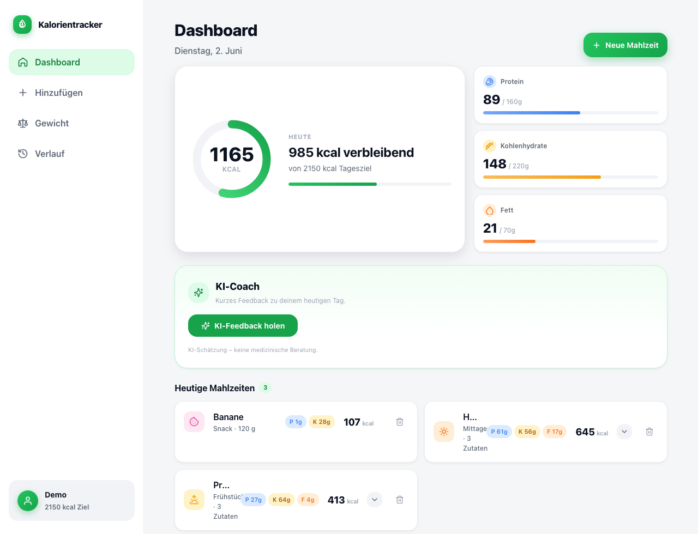 |

- **Aus Evaluation abgeleitet?:** Nein – Produktentscheid.

### 4.7 KI-Coach: Tages-Feedback (OpenRouter)
- **Beschreibung & Nutzen:** Auf dem Dashboard liefert ein **KI-Coach** auf Knopfdruck ein kurzes, motivierendes Feedback zum heutigen Tag samt einem konkreten Tipp. Die App schickt dazu die Tageswerte (Ziel + bisher gegessene Kalorien/Makros, Anzahl Einträge) an ein Sprachmodell und zeigt die Antwort an. Der Aufruf passiert **nur auf Klick** (keine Aufrufe/Kosten im Hintergrund); die Ausgabe ist ausdrücklich als Coaching/Schätzung, nicht als medizinische Beratung gekennzeichnet.
- **Wo umgesetzt:**
  - **Frontend:** „KI-Coach"-Karte auf dem Dashboard [src/routes/+page.svelte](kalorientracker/src/routes/+page.svelte) (Button mit Lade- und Fehlerzustand, ruft den Endpunkt per `fetch` auf).
  - **Backend:** Server-Endpunkt [src/routes/api/coach/+server.js](kalorientracker/src/routes/api/coach/+server.js) (lädt die heutigen Einträge und berechnet die Summen serverseitig) und KI-Client [src/lib/server/coach.js](kalorientracker/src/lib/server/coach.js) (Prompt-Aufbau + Aufruf der OpenRouter-API).
  - **Konfiguration:** `OPENROUTER_API_KEY` und `OPENROUTER_MODEL` in der `.env` (serverseitig über `$env/dynamic/private`, analog zu `DB_URI`).
- **Technik:** OpenRouter wird über die **OpenAI-kompatible** Chat-Completions-API per `fetch` angesprochen – ohne zusätzliche Abhängigkeit. Fehlt der Schlüssel oder schlägt der Aufruf fehl, bleibt die App nutzbar und zeigt eine verständliche Meldung.
- **Referenz:** Kap. 6 (KI-Deklaration – die App nutzt KI hier zur **Laufzeit**, nicht nur zur Entwicklung).
- **Aus Evaluation abgeleitet?:** Nein – Produktentscheid.

### 4.8 KI-Nährwertschätzung aus Foto

- **Beschreibung & Nutzen:** Auf der „Hinzufügen"-Seite gibt es neben *Lebensmittel* und *Mahlzeiten* den Tab **„Foto"**. Ein Klick auf den Tab öffnet **direkt** die Kamera (mobil, via `capture`) bzw. den Dateidialog (Desktop). Aus dem aufgenommenen oder gewählten Foto schätzt ein **multimodales Sprachmodell die Nährwerte je 100 g/ml** (Kalorien, Protein, Kohlenhydrate, Fett). Die Werte erscheinen in einem editierbaren Formular – man prüft/korrigiert sie und kann den Eintrag **direkt für heute erfassen** oder **als wiederverwendbares Lebensmittel speichern**. Das senkt genau die in der Evaluation kritisierte Hürde der manuellen Nährwerteingabe.
- **Wo umgesetzt:**
  - **Frontend:** Tab „Foto" in [src/routes/add/+page.svelte](kalorientracker/src/routes/add/+page.svelte) – ein natives Datei-Label mit `capture="environment"`, das beim Klick direkt Kamera/Dateidialog öffnet – mit der Komponente [src/lib/components/PhotoScan.svelte](kalorientracker/src/lib/components/PhotoScan.svelte) – Foto wird im Browser verkleinert, der Schätz-Endpunkt per `fetch` aufgerufen, die Felder sind editierbar mit Live-Vorschau der Portion.
  - **Backend:** Server-Endpunkt [src/routes/api/estimate-nutrition/+server.js](kalorientracker/src/routes/api/estimate-nutrition/+server.js) und KI-Client [src/lib/server/vision.js](kalorientracker/src/lib/server/vision.js) (Vision-Prompt, Aufruf der OpenRouter-API, robustes JSON-Parsing, Validierung/Begrenzung der Werte). Speichern/Eintragen über die Actions `saveScannedFood` bzw. `logFood` in [src/routes/add/+page.server.js](kalorientracker/src/routes/add/+page.server.js).
  - **Konfiguration:** dasselbe `OPENROUTER_API_KEY`/`OPENROUTER_MODEL` wie der KI-Coach; das Modell muss Bildeingabe (Vision) unterstützen (im Einsatz: `google/gemini-3-flash-preview`).
- **Technik:** OpenRouter wird über die OpenAI-kompatible Chat-Completions-API mit einer **Bild-Nachricht** (Foto als data-URL) angesprochen. Die Antwort ist striktes JSON, das serverseitig validiert wird. Schlägt der Aufruf fehl oder wird kein Lebensmittel erkannt, bleibt die App nutzbar und zeigt eine verständliche Meldung.
- **Referenz:** Screenshot unten; KI-Nutzung zur Laufzeit siehe Kap. 6.
- **Aus Evaluation abgeleitet?:** **Teilweise** – adressiert die in der Evaluation als mühsam empfundene manuelle Nährwerteingabe (Kap. 3.5, Problem 2).

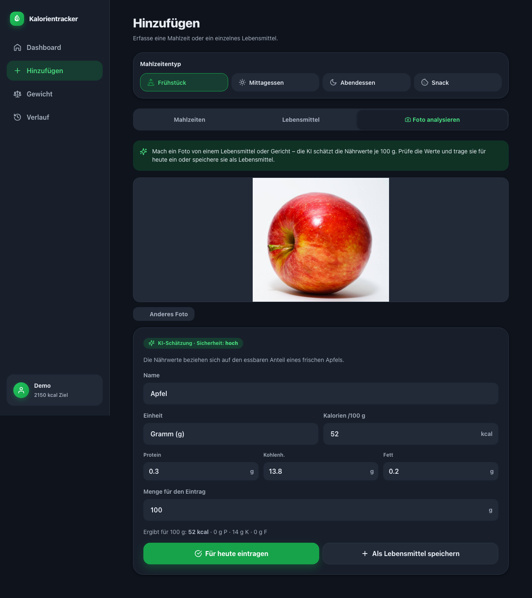

### 4.9 KI-Nährwertschätzung aus Freitext

- **Beschreibung & Nutzen:** Auf der „Hinzufügen"-Seite gibt es zusätzlich den Tab **„Text"**. Statt jedes Lebensmittel einzeln zu suchen, beschreibt man eine Mahlzeit **in eigenen Worten** (z. B. *„2 Eier und ein Toast mit Butter"*). Ein Sprachmodell schätzt daraus **Menge und Nährwerte je 100 g/ml**. Die Werte erscheinen – wie bei der Foto-Schätzung – in einem **editierbaren** Formular mit Live-Vorschau der Portion und lassen sich **direkt für heute erfassen** oder **als Lebensmittel speichern**. Damit wird die in der Evaluation kritisierte mühsame manuelle Eingabe weiter gesenkt; die Eingabe per Sprache ist für viele Alltagsfälle der schnellste Weg.
- **Wo umgesetzt:**
  - **Frontend:** Tab „Text" in [src/routes/add/+page.svelte](kalorientracker/src/routes/add/+page.svelte) mit der Komponente [src/lib/components/FoodTextScan.svelte](kalorientracker/src/lib/components/FoodTextScan.svelte) (Freitextfeld mit Beispiel-Vorschlägen, ruft den Schätz-Endpunkt per `fetch` auf, editierbare Felder mit Portions-Vorschau).
  - **Backend:** Server-Endpunkt [src/routes/api/estimate-food-text/+server.js](kalorientracker/src/routes/api/estimate-food-text/+server.js) und KI-Client [src/lib/server/foodText.js](kalorientracker/src/lib/server/foodText.js) (Prompt-Aufbau, Aufruf der OpenRouter-API, robustes JSON-Parsing, Validierung/Begrenzung der Werte). Eintragen/Speichern über dieselben Actions `logFood` bzw. `saveScannedFood` wie bei der Foto-Schätzung.
  - **Konfiguration:** dasselbe `OPENROUTER_API_KEY`/`OPENROUTER_MODEL` wie KI-Coach und Foto-Schätzung (hier genügt ein Textmodell).
- **Technik:** OpenRouter über die OpenAI-kompatible Chat-Completions-API per `fetch`; die Antwort ist striktes JSON, das serverseitig validiert und begrenzt wird. Schlägt der Aufruf fehl oder ist nichts erkennbar, bleibt die App nutzbar und zeigt eine verständliche Meldung.
- **Referenz:** KI-Nutzung zur Laufzeit siehe Kap. 6.
- **Aus Evaluation abgeleitet?:** **Teilweise** – adressiert wie 4.8 die manuelle Nährwerteingabe (Kap. 3.5, Problem 2).

### 4.10 Barcode-Scanner mit Open-Food-Facts-Abgleich

- **Beschreibung & Nutzen:** Der Tab **„Barcode"** ermöglicht das Erfassen über den Strichcode eines Produkts. Man fotografiert den Barcode; die App **liest die Barcode-Nummer** und **gleicht sie mit der Open-Food-Facts-Datenbank** ab, um Name und Nährwerte automatisch zu übernehmen. Die Werte sind – wie bei Foto- und Freitext-Erfassung – editierbar und lassen sich für heute eintragen oder als Lebensmittel speichern. Das ist für verpackte Produkte der schnellste und genaueste Weg.
- **Wo umgesetzt:**
  - **Frontend:** Tab „Barcode" in [src/routes/add/+page.svelte](kalorientracker/src/routes/add/+page.svelte) mit der Komponente [src/lib/components/BarcodeScan.svelte](kalorientracker/src/lib/components/BarcodeScan.svelte). Die Barcode-Erkennung läuft **zweistufig**: zuerst die native Browser-API **`BarcodeDetector`** (schnell & offline, wo verfügbar); schlägt das fehl oder fehlt die Unterstützung, liest **ein Sprachmodell die Ziffern aus dem Foto** (Fallback). Zusätzlich gibt es ein Feld zur **manuellen Eingabe** der Nummer.
  - **Backend:** Produkt-Lookup [src/routes/api/product-by-barcode/+server.js](kalorientracker/src/routes/api/product-by-barcode/+server.js) (Open Food Facts Produkt-API per Barcode, Mapping auf je 100 g) und KI-Fallback [src/routes/api/read-barcode/+server.js](kalorientracker/src/routes/api/read-barcode/+server.js) + [src/lib/server/barcode.js](kalorientracker/src/lib/server/barcode.js). Eintragen/Speichern über dieselben Actions `logFood` / `saveScannedFood`.
- **Technik:** `BarcodeDetector` ist eine native Web-API (auf vielen mobilen Browsern verfügbar). Der Lookup nutzt die **kostenlose** OFF-Produkt-API ohne Key. Ist ein Produkt nicht in der Datenbank, erkennt die App das (HTTP 404) und bietet die manuelle Ergänzung der Werte an.
- **Referenz:** Lebensmitteldaten siehe Kap. 7 (Open Food Facts, ODbL); KI-Fallback siehe Kap. 6.
- **Aus Evaluation abgeleitet?:** **Teilweise** – senkt wie 4.8/4.9 die manuelle Eingabe (Kap. 3.5, Problem 2), speziell für verpackte Produkte.

## 5. Projektorganisation

- **Repository & Struktur:** SvelteKit-Standard mit `src/routes/` (Routen + Server-Loader/Actions), `src/lib/components/` (UI), `src/lib/` (reine Hilfslogik), `src/lib/server/` (DB-Layer & Auth, nur serverseitig importierbar), `static/` (Assets). `Informationen/`, `Usability-Evaluation/`, `.claude/`, `.env`, `node_modules/`, `build/` und `.svelte-kit/` sind in `.gitignore` ausgeschlossen.
- **Branching:** `main` enthält die aktuelle App, `prototyp-1` den **eingefrorenen ersten Prototyp** (Stand der Usability-Evaluation). Beide Branches sind je mit einem eigenen Cloudflare-Pages-Projekt und einer eigenen, isolierten Datenbank verbunden, damit Evaluations- und Weiterentwicklungsdaten sich nicht vermischen.
- **Issue-/Herausforderungs-Log:** In der Einzelarbeit wurden Aufgaben nicht über ein formales Board, sondern entlang konkreter technischer Herausforderungen abgearbeitet (viel davon Know-how-Beschaffung). Die wichtigsten gelösten Punkte:

| Herausforderung | Lösung |
| --- | --- |
| **Separater Branch für den ersten Prototyp** – für die Evaluation getrennt vorhalten und einzeln deployen | Branch `prototyp-1` + eigenes Cloudflare-Projekt + isolierte DB (eigene Live-URL) |
| **Deployment: lokaler Build vs. Cloud-Build** – Cloudflares Build-Container bündelt den nativen MongoDB-Treiber fehlerhaft (zirkuläre CommonJS-Abhängigkeiten); lokal gebaut läuft alles | Build lokal erzeugen + `wrangler pages deploy` (Skript `deploy.sh`); automatische Cloud-Builds deaktiviert, git-Verknüpfung bleibt bestehen |
| **MongoDB auf der Workers-Runtime** – globale DB-Verbindung „hängt" beim 2. Request | Verbindung pro Request frisch öffnen (Workers-Erkennung in `kalorientracker/src/lib/server/db.js`) |
| **Umgebungsvariablen auf Cloudflare** | `$env/dynamic/private` (Laufzeit) statt `static` (Build-Zeit); Secrets als Pages-Variablen hinterlegt |

- **Commit-Praxis:** Kurze, sprechende Commits im Imperativ (z. B. „Add login and per-user accounts", „Add onboarding and weight tracker", „Add food database and ingredient-based meals", „Improve food search relevance and ranking").

## 6. KI-Deklaration

### 6.1 KI-Tools
- **Eingesetzte Tools:** **Claude Code** (Anthropic, Modell Claude Opus 4.x) als zentrales Werkzeug für die Implementierung – im agentischen Workflow (siehe Kap. 6.4). Konzept, Mockup und Evaluation entstanden ohne weitere KI-Tools.
- **Zweck & Umfang:** KI wurde umfassend für die **technische Umsetzung** eingesetzt: Erstellen und Refactoring des SvelteKit-Codes (Routen, Komponenten, Datenbank-Layer, Authentifizierung, Anbindung der Lebensmittel-API), CSS/Design-Feinschliff, Verifikation per Build- und Browser-Tests sowie Textentwürfe (u. a. diese README). Das **Produkt- und UX-Konzept, die Feature-Entscheide, die Auswahl zwischen Optionen** (z. B. Berechnungsmethode für den Kalorienbedarf, Foto-Speicherung in der DB, Wahl der Lebensmittel-Datenbank) sowie das **Testen** habe ich vorgegeben bzw. selbst durchgeführt; die KI hat auf diese Vorgaben hin umgesetzt und Optionen vorgeschlagen.
- **Eigene Leistung (Abgrenzung):** Problemraumanalyse und App-Konzept, das Figma-Mockup und das Dokument „Workflows und Designentscheide", die Festlegung des Funktionsumfangs, sämtliche Produkt- und Designentscheidungen, das Abnehmen/Testen der Ergebnisse sowie die Vorbereitung und Durchführung der Usability-Evaluation.
- **KI als Produkt-Feature (Laufzeit):** Über die in Kap. 4.7–4.10 beschriebenen Funktionen nutzt die App **zur Laufzeit selbst** ein (multimodales) Sprachmodell über OpenRouter: der **KI-Coach** übermittelt die Tageswerte (Ziel und Tagessummen, keine Klarnamen oder Kontaktdaten), die **Foto-Nährwertschätzung** das aufgenommene **Bild**, die **Freitext-Schätzung** die eingegebene **Beschreibung** und der **Barcode-Scanner** als Fallback das Barcode-**Foto** an den Anbieter. Das ist von der KI-Nutzung zur *Entwicklung* (oben) zu unterscheiden.

### 6.2 Prompt-Vorgehen
Ich bin **iterativ in kleinen Schritten** vorgegangen – Funktion für Funktion statt einer einzigen „bau mir die App"-Anfrage. Pro Schritt habe ich den Kontext und die gewünschte Konvention vorgegeben (z. B. Svelte-5-Runes statt Stores, DB-Zugriffe nur im Server-Layer) und bei grösseren Entscheidungen bewusst Rückfragen bzw. Optionen abgewogen, bevor umgesetzt wurde. Vorschläge habe ich vor der Übernahme gelesen, im Browser getestet und bei Bedarf angepasst. Beispiel-Prompt: _„Baue ein Onboarding, das Geschlecht/Alter/Grösse/Gewicht/Aktivität/Ziel abfragt und daraus mit Mifflin-St Jeor ein Kalorien- und Makroziel berechnet und im Profil speichert."_

### 6.3 Reflexion
- **Nutzen:** KI hat Boilerplate (CSS, Form-Actions, MongoDB-Patterns) und das Aufsetzen der Toolchain deutlich beschleunigt und half, gängige Best Practices (Zugriffsschutz, sichere Passwort-Speicherung) sauber umzusetzen.
- **Grenzen:** Bei Konzept- und Architekturfragen lieferte die KI eher Optionen als die eine Antwort – entscheiden musste ich selbst. Fachliche Korrektheit (z. B. Nährwert-Formeln) habe ich gegengeprüft.
- **Risiken / Qualitätssicherung:** Nach jedem Schritt manuelles Lesen des Codes sowie Build- und Browser-Tests des betroffenen Bereichs. Erkenntnis: KI ist als Pair-Programmer stark, ersetzt aber weder Konzept noch Validierung.

### 6.4 KI-Agenten-Workflow (über den Unterrichtsumfang hinaus)

Statt reinem Chat-Prompting kam ein **agentischer Workflow** zum Einsatz – im Raster ausdrücklich als mögliche Erweiterung genannt:

- **Werkzeug:** **Claude Code** (agentische CLI von Anthropic, im VS-Code-Terminal). Der Agent liest und schreibt Dateien selbst, führt den Build aus, testet im Headless-Browser und committet – nicht nur Textvorschläge.
- **Persistenter Projektkontext / Memory:** Ein dauerhaftes Projektgedächtnis hält meine Vorgaben über Sitzungen hinweg fest – z. B. Antwortsprache, Commit-Stil, Architekturregeln („DB-Zugriffe nur im Server-Layer", „Svelte-5-Runes statt Stores") und die Regel, den **Mindestumfang stabil** zu halten. Der Agent wendet diese Konventionen konsistent an.
- **Kontextquellen:** Codebasis, Aufgabenstellung und Bewertungsraster (PDFs), eigenes Dokument „Workflows und Designentscheide".
- **Arbeitsweise mit Verifikationsschleife:** iterativ in kleinen Schritten (Funktion für Funktion); nach jedem Schritt automatisch **Build + Browser-/Screenshot-Test** – Screenshots z. B. gegen eine isolierte In-Memory-Datenbank, damit die Produktionsdaten unangetastet bleiben.
- **Abgrenzung:** Produkt-/UX-Entscheide, fachliche Korrektheit und Validierung lagen bei mir; der Agent setzte auf diese Vorgaben hin um und schlug Optionen vor.

## 7. Anhang

- **Artefakte (`docs/`):** Markt-/Konkurrenz- & Datenquellen-Analyse ([docs/marktanalyse.md](docs/marktanalyse.md)), Skizzen der Lösungsvarianten ([docs/sketches/varianten.svg](docs/sketches/varianten.svg)), User-Journey-Map ([docs/journey-map.svg](docs/journey-map.svg)), App-Screenshots ([docs/screenshots/](docs/screenshots/)).
- **Quellen:**
  - **Lebensmitteldaten:** [Open Food Facts](https://world.openfoodfacts.org/) – die Produktdaten stehen unter der **Open Database License (ODbL)**, einzelne Inhalte unter der Database Contents License; Bilder unter CC-BY-SA. Die Daten werden ausschliesslich abgefragt und angezeigt (Abfrage in [src/routes/api/food-search/+server.js](kalorientracker/src/routes/api/food-search/+server.js)).
  - **Icons:** Lucide (ISC/MIT-Lizenz), in [src/lib/components/Icon.svelte](kalorientracker/src/lib/components/Icon.svelte) als Inline-SVG nachgebaut.
  - **Berechnungsmethode:** Grundumsatz nach Mifflin-St Jeor; Aktivitätsfaktoren und Makro-Empfehlungen aus gängiger Ernährungs-/Sportwissenschaft.
  - **Doku:** SvelteKit (svelte.dev), MongoDB-Node-Treiber.
- **Testskript & Materialien:** Aufgabenblatt (7 Szenarien), Vorab- und Abschlussfragen sowie das Feedback-Grid liegen unter `Usability-Evaluation/` (lokal, nicht im öffentlichen Repo).
- **Rohdaten/Auswertung:** Beobachtungen pro Testperson im Feedback-Grid (`Usability-Evaluation/`); die verdichteten Ergebnisse stehen in Kap. 3.5.

---

## Setup & Entwicklung

> Die App liegt im Unterordner [`kalorientracker/`](kalorientracker/); alle folgenden Befehle dort ausführen.

```sh
cd kalorientracker

# Abhängigkeiten installieren
npm install

# .env aus der Vorlage anlegen und Werte eintragen
# (MongoDB-URI erforderlich; OpenRouter optional – nur für die KI-Funktionen 4.7–4.9)
cp .env.example .env
# anschliessend .env öffnen und DB_URI (und optional OPENROUTER_*) ausfüllen

# Dev-Server
npm run dev

# Production-Build + Preview
npm run build
npm run preview
```

### Deployment

Der Build wird lokal erzeugt und zu Cloudflare Pages hochgeladen. Das Skript [`deploy.sh`](deploy.sh) (Repo-Root) erkennt den aktuellen Branch automatisch (`main` → Hauptseite, `prototyp-1` → Prototyp), baut und lädt hoch:

```sh
# einmalig: bei Cloudflare anmelden
npx wrangler login

# danach pro Deploy:
./deploy.sh
```
